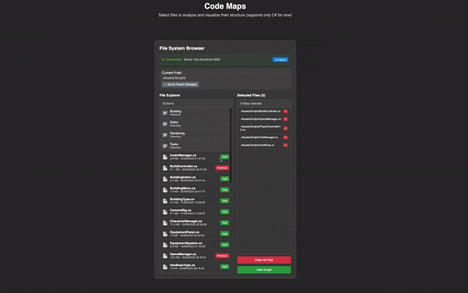

# CodeMaps - Dependency Visualizer for C# and Typescript code
<!-- demo gif here -->


Welcome to CodeMaps! Gain better control over your software by visualizing the code structure and relationships between classes and methods in your project.

## Motivation

I was looking for a graphic tool to help me analyse the dependencies and spot inefficiencies in my Unity game project. After a few attempts to find a solution that works for me, I decided to give it a go and make one that does.

## Quick Start

### 1. Run Codemaps container
CodeMaps is a web interface with a dedicated local http server allowing it to access files on your system.

### 1.1 (Recommended) Allocate a directory to persist graph data outside the container
```bash
# Create the directory with proper permissions
cd /path/to/your/project
mkdir -p .codemaps-data
chmod 755 .codemaps-data
```

### 1.2 Use your Docker environment to run it on your local machine using one of the following methods:

### Either manually...

```bash
# Mount your project directory
docker run -p 3001:3001 
-v /path/to/your/project:/app/code:ro 
-v /path/to/your/project/data:/app/data silverveskilt/codemaps:latest 
```

### ...or using docker-compose
```yaml
# docker-compose.yml
services:
  codemaps:
    image: silverveskilt/codemaps:latest
    ports:
      - "3001:3001"
    volumes:
      - ./:/app/code:ro #  this is 
      - ./.codemaps-data:/app/data # codemaps stores metadata to this directory to preserve graph state throughout sessions
    environment:
      - NODE_ENV=production
```

### 2. Connect and Analyze

1. **Browse the files** in the working directory in the file browser
2. **Select your files** and click "View Graph"

## Features

- **File Analysis**: Parses source files to extract classes, methods, and properties. Supports **C#** and **Typescript** files
- **Dependencies Between Classes and methods**: Visualizes relationships and dependencies between different 
- **Move pieces around**: Organize your components the way it makes most sense to you.
- **Evolve**: Your layout is saved in browser storage. The graph picks up the changes as you update code. You can always add new files or remove them from the layout.

## Security Notes

All processing of your files happens on your machine. Codemaps does not collect or share the contents of your files with remote servers.

## Next steps

- Ship as standalone application for macOS
- ~~Add Typescript parser~~
- Enable visualizing loosely coupled systems
- Ship as a plugin for Cursor and VSCode  
- Have a new idea how to make this tool more useful to you? 👇

## Support

For issues and questions:
- Reach out on https://www.linkedin.com/in/silverveskilt/ or to my email silverveskilt@gmail.com
- Open an issue in this github space
